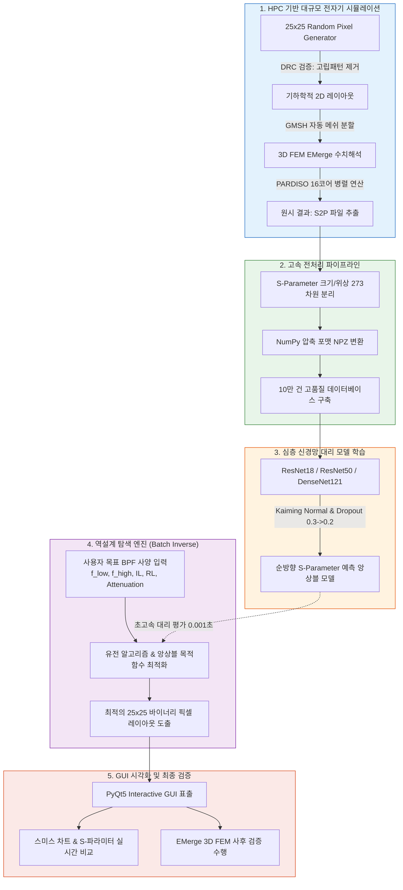

<div align="center">
  <h1>⚡ CorRaL V4 : 딥러닝 기반 픽셀형 RF 대역통과 필터(BPF) 역설계 및 전자기 해석 완전 자동화 플랫폼</h1>
  <h3>금오공과대학교 캡스톤 디자인 종합설계 프로젝트 (한국전자파학회 2026 하계종합학술대회 발표 논문)</h3>
  <p>
    
    
    
    
    
  </p>
</div>

<br/>

## 📖 1. 프로젝트 총괄 개요 (Executive Summary)

본 프로젝트는 **UWB(Ultra-Wideband) 레이더 및 차세대 통신 시스템**에 적용 가능한 고성능 평면형 마이크로스트립 대역통과 필터(BPF)를 **초고속으로 자동 설계하는 AI-Assisted Inverse Design 플랫폼**입니다.

전통적인 RF 회로 설계 방식은 고주파 엔지니어의 경험과 직관에 의존하여 기본 구조를 잡은 후, 상용 전자계 시뮬레이터(Keysight ADS, Ansys HFSS 등)를 이용해 파라미터를 수동으로 하나하나 튜닝하는 '반복적 시행착오'를 거칩니다. 이는 1회의 3D EM 시뮬레이션에만 수십 분이 소요되어 설계 기간과 비용이 천문학적으로 증가하는 치명적 한계가 있습니다.

이를 혁신하기 위해 본 프로젝트는 다음과 같은 **완전 자동화 엔드투엔드(End-to-End) 파이프라인**을 완성했습니다:
1. **오픈소스 3D FEM 솔버(EMerge)**를 금오공대 슈퍼컴퓨터(HPC) 클러스터에 이식하여 **100,000건 이상의 대규모 고품질 S-파라미터 데이터셋**을 완전 무인 자동화로 구축.
2. 25×25 이진 픽셀 격자 구조를 273차원 복소 S-파라미터(크기·위상)로 매핑하는 **ResNet18 / ResNet50 / DenseNet121 기반 전이학습(Transfer Learning) 순방향 대리 모델(Forward Surrogate)** 학습.
3. 사용자가 원하는 필터 사양(차단 주파수, 통과대역, 삽입 손실, 반사 손실, 감쇠도)을 입력하면 유전 알고리즘(GA) 및 앙상블 탐색을 통해 최적의 25×25 픽셀 레이아웃을 역으로 찾아내는 **헤드리스 배치 역설계 엔진 및 PyQt5 GUI 플랫폼** 구축.

---

## 🏗️ 2. 전체 시스템 아키텍처 및 워크플로우 (System Workflow)

전체 시스템은 **[데이터 생성 (HPC)] → [데이터 전처리 및 압축] → [AI 대리 모델 학습] → [역설계 최적화 알고리즘] → [GUI 시각화 및 EM 재검증]**의 유기적인 5단계로 연결됩니다.



---

## 📐 3. EMerge 3D FEM 전자기 해석 물리 파라미터 및 기판·에어박스 세부 명세

상용 시뮬레이터(Keysight ADS) 수준의 해석 정확도를 확보하면서도, 슈퍼컴퓨터의 대규모 연산 시 메모리 오버플로우(Memory Kill)를 원천 차단하기 위해 수백 회의 실험을 거쳐 정밀하게 확립된 **3D 물리적 기판, 픽셀 메쉬, 경계 조건 및 해석 환경 종합 명세서**입니다.

### 📊 1) 물리적 기판(Substrate) 및 금속 도체 사양
| 구분 | 설계 항목 (Parameter) | 상세 설정값 및 규격 | 엔지니어링 설계 의도 및 비고 |
| :--- | :--- | :--- | :--- |
| **기판 (Substrate)** | 기판 가로 x 세로 크기 | **20.0 mm x 20.0 mm** | 기존 35x35mm 대비 연산량 및 데이터 범용성을 위해 20mm 축소 |
| | 기판 두께 (Height, H) | **1.2 mm** | 실제 PCB 제작 환경 및 내구성 고려한 표준 규격 |
| | 비유전율 (Relative Permittivity, εr) | **4.0** | 상용 FR-4 유사 유전체 물성 적용 |
| | 유전 정접 (Loss Tangent, tanδ) | **0.013** | 고주파 유전체 손실 모사 |
| | 기판 영역 내부 메쉬 크기 | **1.0 mm** (유전체 파장 λd / 5) | 전자기장이 극단적으로 집중되지 않으므로 연산 속도 확보용 조정 |
| **상부 도체 (Top Layer)** | 픽셀 패턴 금속 재질 | **순금 (Gold, Au)** | 고주파 전도도 우수성 및 산화 방지 기준 |
| | 금속 전도도 (Conductivity, \sigma) | **4.1 × 10⁷ S/m** | 고주파 표피 저항 손실 정밀 계산용 |
| | 도체(트레이스) 두께 | **0.017 mm (17 ㎛)** | 표준 0.5 oz 동박(Copper) 두께와 동일 |
| **하부 접지 (Bottom Layer)**| 그라운드 플레인 (Ground Plane) | **전면 도체 (Solid Metal)** | 완전 도체 접지면 형성 |
| | 접지면 두께 | **0.017 mm (17 ㎛)** | 상부 도체와 동일 두께 |
| | 접지면 경계 조건 | **PEC (Perfect Electric Conductor)** | 바닥면 전자기파 완벽 반사 및 기준 접지 전위 고정 |

---

### 🧩 2) 25x25 픽셀 격자(Pixel Grid) 및 입출력 포트(Port) 사양
| 구분 | 설계 항목 (Parameter) | 상세 설정값 및 규격 | 엔지니어링 설계 의도 및 비고 |
| :--- | :--- | :--- | :--- |
| **픽셀 구조** | 전체 격자 배열 (Grid Array) | **25 x 25 격자 (총 625개 픽셀 셀)** | 딥러닝 입력 텐서(1, 25, 25)와 1:1 매핑 |
| | 단위 픽셀 셀 크기 | **0.4 mm x 0.4 mm** | 상용 PCB 에칭 공정 한계를 고려한 최소 해상도 |
| | 전체 픽셀 활성 영역 | **10.0 mm x 10.0 mm** | 기판 중앙에 배치 (기판 외곽선으로부터 5.0mm 안쪽 마진) |
| | 대각 연결(Chamfer) 제거 | **Mosaic v2 구조 적용** | 대각선 삼각 연결 로직을 완전히 제거하여 딥러닝 입력의 단순성 확보 |
| | 랜덤 생성 밀도 가중치 | **25% ~ 60% 가중 확률 분포** | 지나친 오픈/쇼트 패턴을 방지하고 유효 공진 패턴 집중 생성 |
| **입출력 포트** | 포트 타입 (Port Type) | **50Ω 럼프드 포트 (Lumped Port)** | 2-Port 네트워크 S11, S21, S12, S22 전송 파라미터 추출 |
| | 포트 접속선 (Feed Line) | 좌/우측 대칭 2개소 배치 | 폭: **1.2 mm**, 길이: **3.0 mm** (50Ω 특성 임피던스 매칭 선폭) |
| | 포트 Y축 기준 위치 | **Y = 10.0 mm (기판 정중앙)** | 대칭 구조 급전 및 반사손실 최소화 |

---

### 📦 3) 에어박스(Air Box) 및 전자기 경계 조건(Boundary Conditions)
| 구분 | 설계 항목 (Parameter) | 상세 설정값 및 규격 | 엔지니어링 설계 의도 및 비고 |
| :--- | :--- | :--- | :--- |
| **에어박스 크기** | X축 및 Y축 크기 | **40.0 mm x 40.0 mm** | 기판(20x20mm)의 정확히 **2배** 설정 (ADS와 동일한 방사 특성 확인) |
| | 에어박스 순수 높이 (Z_air) | **9.375 mm** | λ/4 설정 시 메모리 킬 발생 \rightarrow 반복 튜닝으로 찾은 **최적 높이** |
| | 전체 3D 해석 영역 높이 (Z_total)| **약 10.592 mm** | 접지 바닥부터 기판(1.2) + 도체(0.017) + 에어(9.375)의 총합 |
| **흡수 경계 조건** | 5개 면 경계 조건 (상단, 전/후/좌/우) | **2차 Bayliss-Turkel ABC** | 방사되는 고주파 전자기파가 반사 없이 완벽히 흡수되도록 설정 |
| | 바닥면 경계 조건 | **PEC (Perfect Electric Conductor)** | 하부 접지면과 일체화하여 외부 방사 차단 및 접지 기준 형성 |

---

### 🕸️ 4) 물리 현상 기반 가변 메쉬(Mesh) 및 연산 최적화 전략
| 구분 | 설계 항목 (Parameter) | 상세 메쉬 크기 | 물리 현상 고려 이유 (Physics-Aware Reason) |
| :--- | :--- | :--- | :--- |
| **도체 모서리** | 금속 가장자리 최소 메쉬 크기 | **약 0.333 mm** (유전체 파장 λd / 15) | **Skin Effect(표피 효과):** 고주파에서 전류가 도체 표면/에지에 집중되므로 초미세 메쉬 필수 |
| **픽셀 근처 공기** | 에어박스 내부 점증 비율 | **Growth Rate = 5** | **Fringing Field(가장자리 전기장):** 에지에서 공기로 튀어나오는 전자기파를 연속적으로 추적 |
| **외곽 에어 영역** | 에어박스 외곽 최대 메쉬 크기 | **2.5 mm** (자유공간 파장 λ0 / 4) | 방사 강도가 약한 허공 영역은 메쉬를 듬성하게 늘려 메모리와 해석 시간 대폭 절감 |
| **수치해석 엔진** | 메쉬 생성 엔진 / FEM 솔버 | **GMSH / Intel MKL PARDISO** | 고성능 슈퍼컴퓨터 환경에 최적화된 다중 코어(8~16 Core) 병렬 희소 행렬 연산 |

---

### 📈 5) 주파수 스윕(Frequency Sweep) 및 출력 데이터 규격
| 구분 | 세부 항목 | 설정값 및 데이터 구성 | 비고 |
| :--- | :--- | :--- | :--- |
| **해석 주파수 대역**| 전체 해석 범위 (Sweep Range) | **0.1 GHz ~ 30.0 GHz** | 자유공간 파장 λ0 = 10mm, 유전체 내 파장 λd = 5mm (30GHz 기준) |
| | 총 샘플 포인트 수 | **총 91개 주파수 포인트** | 광대역 특성 곡선 복원용 |
| **대역별 간격** | 저주파 대역 (0.1 ~ 1.5 GHz) | **0.5 GHz 스텝** (넓은 간격) | 불필요한 연산 낭비 억제 |
| | **BPF 타깃 대역 (2.0 ~ 12.0 GHz)**| **0.2 GHz 스텝 (최고 밀집 간격)** | 실제 필터의 통과/저지대역 스펙 및 공진점을 극도로 정밀하게 계측 |
| | 고주파 대역 (12.5 ~ 30.0 GHz) | **0.5 GHz 스텝** (넓은 간격) | 고주파 스퓨리어스(Spurious) 응답 모니터링 |
| **추출 데이터** | 출력 데이터 포맷 3종 | **S2P, PNG, NPZ** | S2P(복소 S-파라미터), PNG(패턴 시각화), NPZ(25x25 바이너리 압축 배열) |
| | AI 입력 차원 및 타깃 차원 | **입력: (1, 25, 25) \rightarrow 출력: 273차원** | 91개 포인트 x (S11, S21 크기 및 위상 성분)을 완벽하게 벡터화 |

---

## 🧠 4. 딥러닝 순방향 대리 모델 아키텍처 (`models.py`)

기존 ImageNet 기반 거대 모델들을 **25×25 1채널 소형 바이너리 입력**에 맞게 수학적/구조적으로 전면 개조했습니다.

### 1) 입력 어댑테이션 및 가중치 전이 (Weight Interpolation)
* 원본 ResNet의 `conv1` (7×7, Stride 2, 3채널)은 25×25 크기의 픽셀 정보를 단번에 잃어버리는 문제가 있습니다.
* 이를 해결하기 위해 첫 단을 **3×3 Kernel, Stride 1, Padding 1, 1채널 Conv 레이어로 개조**하고, ImageNet 사전학습 3채널 가중치를 채널 평균 후 Bilinear Interpolation(3×3)하여 이식하는 **커스텀 전이학습**을 구현했습니다.
* Max Pooling 레이어는 `nn.Identity()`로 치환하여 소형 픽셀의 공간 해상도 손실을 방지했습니다.

### 2) 다층 회귀 헤드 (Multi-Stage Regression Head)
* **ResNet50:** 2048 차원 특징 벡터 \rightarrow `Linear(2048, 1024)` \rightarrow `BatchNorm1d` \rightarrow `ReLU` \rightarrow `Dropout(0.3)` \rightarrow `Linear(1024, 512)` \rightarrow `BatchNorm1d` \rightarrow `ReLU` \rightarrow `Dropout(0.2)` \rightarrow `Linear(512, 273)`
* **출력 273차원 구성:** 0.1GHz ~ 30GHz 구간의 총 91개 주파수 샘플 포인트에 대해 4개 S-파라미터 크기 및 위상 완벽 예측.
  * Magnitude: S11(dB), S21(dB) (주요 대역)
  * Phase: S11(Phase), S21(Phase)

---

## ⚙️ 5. 헤드리스 배치 역설계 엔진 (`run_batch_inverse.py`)

슈퍼컴퓨터 및 서버 환경에서 GUI 없이 대량의 필터 후보군을 고속 탐색하는 최적화 엔진입니다.

1. **타깃 스펙 정의 (Target Spec):**
   * 통과대역 시작 주파수(f_low) 및 종료 주파수(f_high)
   * 삽입 손실(Insertion Loss), 반사 손실(Return Loss), 저지대역 감쇠량(Stopband Loss)
2. **복합 손실 함수 (Composite Cost Function):**
   Cost = w_1 \cdot Loss_{Passband} + w_2 \cdot Loss_{Stopband} + w_3 \cdot Loss_{ReturnLoss} + w_{DRC} \cdot Penalty_{DRC}
   * 실제 제작이 불가능한 고립 패턴(Floating Metal) 및 에칭 한계 미달 패턴에 강력한 페널티 부여 (DRC 필터링).
3. **앙상블 대리 평가:** ResNet18, ResNet50, DenseNet 복수 모델의 추론 결과를 앙상블하여 예측 분산을 줄이고 전자기적 신뢰성을 극대화.

---

## 🖥️ 6. PyQt5 기반 대화형 GUI 플랫폼 (`inverse_gui_fixed.py`)

엔지니어가 복잡한 코드 없이 클릭 몇 번으로 필터를 역설계하고 검증할 수 있는 통합 워크스테이션입니다.

* **Spec Controller:** f_low, f_high, 대역폭, 손실 허용치를 슬라이더 및 입력창으로 실시간 세팅.
* **Layout Grid View:** AI가 추천한 25×25 픽셀 레이아웃을 직관적인 2D 그래픽 뷰어로 표출하며, 엔지니어가 직접 마우스 클릭으로 패턴을 수정/추가 가능.
* **S-Parameter & Smith Chart Display:** 
  * 목표 스펙 라인 vs AI 예측치 vs EM 실측치를 동일 그래프에 오버레이 표출.
  * 복소 임피던스 궤적을 확인할 수 있는 스미스 차트(Smith Chart) 뷰어 내장.
* **원클릭 검증 파이프라인:** 도출된 최적 픽셀 패턴을 즉시 `EMerge` 시뮬레이션 입력 파일로 변환하여 실제 3D 전자기 해석을 백그라운드로 트리거.

---

## 📁 디렉토리 구조 (Repository Layout)

```
RF_Reverse_Design_Filter_Project/
├── 25x25_pixel_circuit/           # 25x25 랜덤 픽셀 생성기 및 EMerge 연동 스크립트
│   ├── generator_new.py          # DRC 규칙 기반 25x25 바이너리 패턴 생성기
│   ├── simulation.py             # EMerge 전자기 수치해석 실행 스크립트
│   ├── simulation_gmsh.py        # GMSH 메쉬 생성 및 경계조건 설정
│   └── simulation_structure.py   # 기판 및 포트 형상 정의
├── 25x25_custome_pixel_circuit/  # 특정 패턴 분석용 커스텀 파이프라인
├── KIT_HPC/                      # 금오공대 슈퍼컴퓨터(HPC) PBS 배치 스크립트
│   ├── 8CPU_CORE/                # 8코어 단일 노드 최적화 실행 스크립트 (run_batch.sh)
│   └── 16CPU_CORE/               # 16코어 고속 분산 병렬 스크립트 (PARDISO 솔버)
├── Deeplearning&GUI/CorRaL_V4/   # 메인 딥러닝 역설계 플랫폼
│   ├── training/                 # 딥러닝 모델 학습 소스코드
│   │   ├── models.py             # ResNet18/50, DenseNet121 대리 모델 정의
│   │   └── train_25x25.py        # 10만 건 데이터셋 학습 및 검증 루프
│   ├── batch_inverse/            # 슈퍼컴퓨터용 헤드리스 배치 역설계 엔진
│   │   ├── run_batch_inverse.py  # 목적함수 기반 픽셀 탐색 알고리즘
│   │   └── run_batch_inverse.pbs # PBS 작업 제출 스크립트
│   └── gui_resnet/               # 엔드유저용 PyQt5 GUI 통합 애플리케이션
│       ├── inverse_gui_fixed.py  # 메인 GUI 구동 파일
│       ├── Sparam_compare_gui.py # S-파라미터 비교 분석 도구
│       └── Renorm_ops.py         # 임피던스 재정규화 연산 모듈
└── README.md                     # 프로젝트 총괄 기술 문서
```

---

## 🏆 핵심 성과 및 의의 (Key Achievements)

1. **압도적인 설계 시간 단축 (TAT 혁신):**
   * 기존 3D EM 시뮬레이션 기반 반복 설계(수일~수주일 소요) \rightarrow **딥러닝 대리 모델 역설계로 단 1분 이내에 최적 레이아웃 도출**.
2. **100,000건 무인 데이터 파이프라인 완성:**
   * 리눅스 PBS 큐와 EMerge를 결합하여 서버 다운 없는 100% 무인 자동화 전자기 해석 인프라를 구축.
3. **물리 기반 인공지능(Physics-Aware AI):**
   * 블랙박스 형태의 AI를 지양하고, Skin Effect, Fringing Field, DRC 최소 선폭 등 전자기학적·제조 공학적 물리 제약을 모델과 손실 함수에 직접 반영하여 **'실제 제작 가능한(Manufacturable)' 무결점 RF 필터 구조 설계 실현**.
4. **학술적 성과 인정:**
   * 본 연구의 성과를 인정받아 **2026년도 한국전자파학회(KIEES) 하계종합학술대회 논문 발표** 완료.